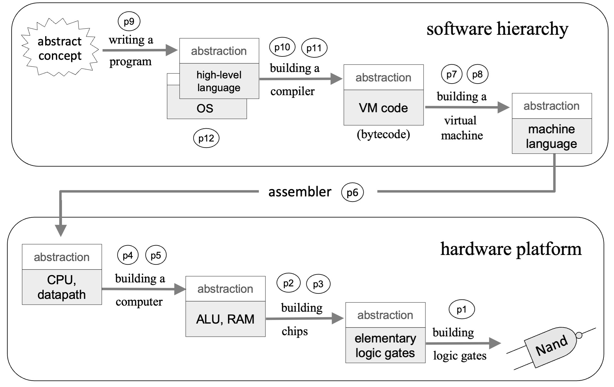
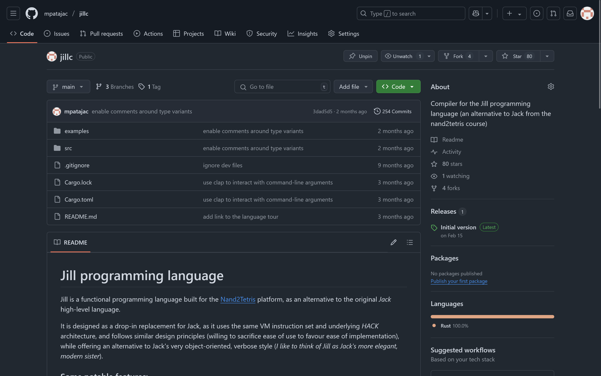
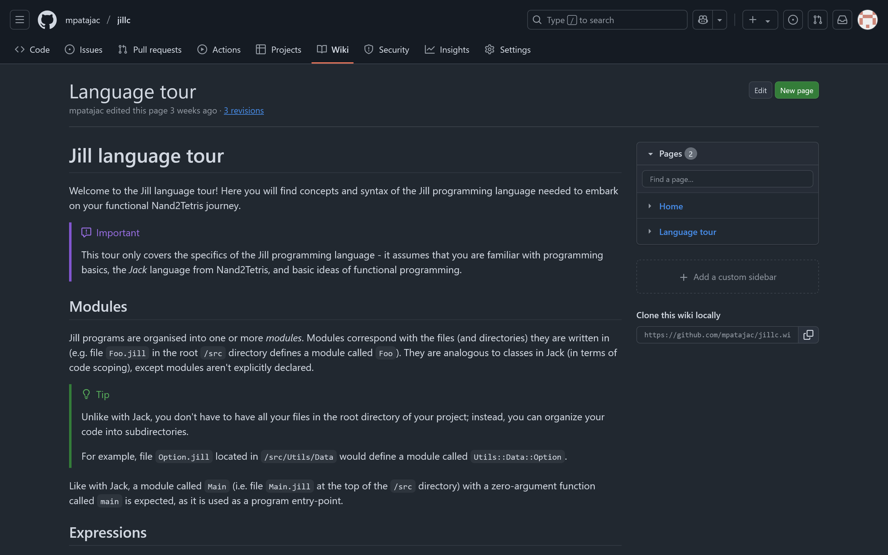
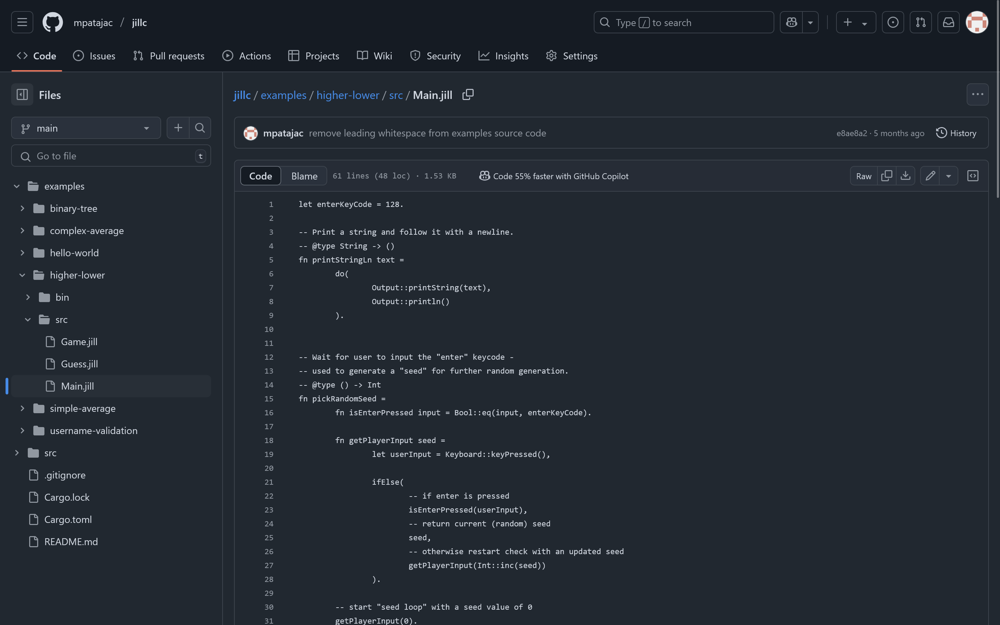
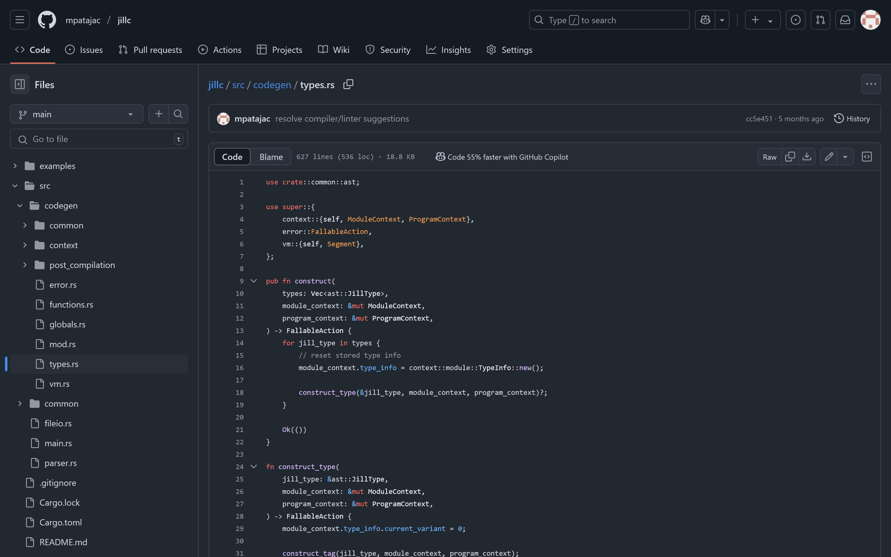

# Jill — funkcijski jezik za Nand2Tetris platformu

<!-- 

- high-level overview (time-constrained)
- informal conversation after official part

 -->

---

# Nand2Tetris

<!-- 

- demonstrates how computers (actually) work

 -->

---
layout: center
---

<!-- TODO: replace with diagram -->




<!-- 

- flow
  - HW (gates, chips, components, CPU)
  - SW (machine code, assembly, VM, Jack)
- edu-first => primitive
  - no decimals (only ints)
  - limited memory
  - limited instruction set
  - ...

 -->

---

`<Jack slide quote>`


<!-- theme: compromise -->


---
layout: center
---

<!-- TODO: replace with diagram -->


<!-- 

- => built a **new language** as a replacement for Jack

 -->


---
transition: none
---


---
layout: fact
---

# ZAŠTO

POBOGU

<!-- bored, too much free time, not employed etc. -->

---

# Jack

<!-- based on early-2000's Java (not nice) -->

---
layout: center
---

`<Jack hello world>`

<!-- very OOP -->

---
layout: center
---

`<Jack keywords/symbols>`

<!-- 

- primitive, but not simple
- many keywords/ways of doing things

 -->

---

# 😅

<!-- *how hard could it be* -->

---

<v-clicks>

- functional paradigm
- drop-in replacement for Jack
- follow Nand2Tetris principles
- modern design

</v-clicks>


<!-- 

- [click] FP principles/constructs 
  - fns-as-vals
  - immutable
  - recursion/HOF over loops
  - ADT
  - modular (both fns and code structure)
  - pattern matching
- [click] drop-in replacement for Jack (100% compatibility with VM; existing tooling => better adoption + I'm lazy)
- [click] follow Jack & Nand2Tetris "spirit" (for-edu, implementation over usage)
- [click] "modern"/improvement (simple, concise, better tooling...)


 -->

---

# Jill

--- 
layout: default
--- 

<v-click>

````md magic-move

```jill
-- this is a comment
```

```jill
-- this is a comment
-- another comment
```

```jill{4}
-- this is a comment
-- another comment

let x = 25.
```

```jill{6-7}
-- this is a comment
-- another comment

let x = 25.

-- @type Bool
let isEarthFlat = False.
```

```jill{6-10}
-- this is a comment
-- another comment

let x = 25.

-- @type Bool
let isEarthFlat = False.

-- ERROR
-- let isEarthFlat = True.
```

```jill{12-13}
-- this is a comment
-- another comment

let x = 25.

-- @type Bool
let isEarthFlat = False.

-- ERROR
-- let isEarthFlat = True.

-- @type List(Int)
let grades = [3, 1, 4, 1, 5].
```

```jill{15}
-- this is a comment
-- another comment

let x = 25.

-- @type Bool
let isEarthFlat = False.

-- ERROR
-- let isEarthFlat = True.

-- @type List(Int)
let grades = [3, 1, 4, 1, 5].

let isXOdd = isOdd(x).
```

```jill{17}
-- this is a comment
-- another comment

let x = 25.

-- @type Bool
let isEarthFlat = False.

-- ERROR
-- let isEarthFlat = True.

-- @type List(Int)
let grades = [3, 1, 4, 1, 5].

let isXOdd = isOdd(x).

let rootOfX = Int::sqrt(x).
```

```jill{19}
-- this is a comment
-- another comment

let x = 25.

-- @type Bool
let isEarthFlat = False.

-- ERROR
-- let isEarthFlat = True.

-- @type List(Int)
let grades = [3, 1, 4, 1, 5].

let isXOdd = isOdd(x).

let rootOfX = Int::sqrt(x).

let _ = Output::moveCursor(12, 1).
```

```jill
-- this is a comment
-- another comment

let x = 25.

-- @type Bool
let isEarthFlat = False.

-- ERROR
-- let isEarthFlat = True.

-- @type List(Int)
let grades = [3, 1, 4, 1, 5].

let isXOdd = isOdd(x).

let rootOfX = Int::sqrt(x).

let _ = Output::moveCursor(12, 1).
```

````


</v-click>


<!-- 

- [click] comment
- [click] no block comments
- [click] variable (using `let`)
- [click] dynamically typed
- [click] immutable variables (constants)
- [click] lists for sequences
- [click] fn call (local)
- [click] fn call (other module)
- [click] discard pattern

 -->

---
layout: default
--- 

<v-click>

````md magic-move

```jill
let foo = Int::mult(
    x,
    Int::sub(7, rootOfX),
).
```

```jill{6-9}
let foo = Int::mult(
    x,
    Int::sub(7, rootOfX),
).

let bar = Bool::and(
    Bool::not(isEarthFlat),
    Bool::eq(x, 3)
).
```

```jill{11}
let foo = Int::mult(
    x,
    Int::sub(7, rootOfX),
).

let bar = Bool::and(
    Bool::not(isEarthFlat),
    Bool::eq(x, 3)
).

let minusSeven = Int::neg(7).
```

```jill
let foo = Int::mult(
    x,
    Int::sub(7, rootOfX),
).

let bar = Bool::and(
    Bool::not(isEarthFlat),
    Bool::eq(x, 3)
).

let minusSeven = Int::neg(7).
```

````

</v-click>

<!-- 

- no operators
- [click:4] usage/implementation compromise (operator format, argument count, precedence, grouping... => all auto-provided with fns)

 -->


---
layout: default
--- 

<v-click>

````md magic-move

```jill
fn isPositive x = Bool::gt(x, 0).
```

```jill{3-}
fn isPositive x = Bool::gt(x, 0).

-- @type Int, Int, Int -> Int
fn clamp x minValue maxValue =
    Int::min(
        Int::max(x, minValue),
        maxValue
    ).
```

```jill{11-}
fn isPositive x = Bool::gt(x, 0).

-- @type Int, Int, Int -> Int
fn clamp x minValue maxValue =
    Int::min(
        Int::max(x, minValue),
        maxValue
    ).


fn isUsernameValid username =
    Bool::and(
        Bool::ge(
			String::length(username), 
			3
		),
        Bool::le(
			String::length(username), 
			50
		),
    ).
```

```jill{12,16,20}
fn isPositive x = Bool::gt(x, 0).

-- @type Int, Int, Int -> Int
fn clamp x minValue maxValue =
    Int::min(
        Int::max(x, minValue),
        maxValue
    ).


fn isUsernameValid username =
	let usernameLength = String::length(username),

    Bool::and(
        Bool::ge(
			String::length(username), 
			3
		),
        Bool::le(
			String::length(username), 
			50
		),
    ).
```

```jill{12,16,20}
fn isPositive x = Bool::gt(x, 0).

-- @type Int, Int, Int -> Int
fn clamp x minValue maxValue =
    Int::min(
        Int::max(x, minValue),
        maxValue
    ).


fn isUsernameValid username =
	let usernameLength = String::length(username),

    Bool::and(
        Bool::ge(
			usernameLength,
			3
		),
        Bool::le(
			usernameLength, 
			50
		),
    ).
```

```jill{11-}
fn isPositive x = Bool::gt(x, 0).

-- @type Int, Int, Int -> Int
fn clamp x minValue maxValue =
    Int::min(
        Int::max(x, minValue),
        maxValue
    ).


fn isUsernameValid username =
	let usernameLength = String::length(username),

    Bool::and(
        Bool::ge(usernameLength, 3),
        Bool::le(usernameLength, 50),
    ).
```

```jill{15,16}
fn isPositive x = Bool::gt(x, 0).

-- @type Int, Int, Int -> Int
fn clamp x minValue maxValue =
    Int::min(
        Int::max(x, minValue),
        maxValue
    ).


fn isUsernameValid username =
	let usernameLength = String::length(username),

    Bool::and(
        Bool::ge(usernameLength, 3),
        Bool::le(usernameLength, 50),
    ).
```

```jill{12,17,18}
fn isPositive x = Bool::gt(x, 0).

-- @type Int, Int, Int -> Int
fn clamp x minValue maxValue =
    Int::min(
        Int::max(x, minValue),
        maxValue
    ).


fn isUsernameValid username =
	fn isLongEnough usernameLength = Bool::ge(usernameLength, 3).

	let usernameLength = String::length(username),

    Bool::and(
        Bool::ge(usernameLength, 3),
        Bool::le(usernameLength, 50),
    ).
```

```jill{12,17,18}
fn isPositive x = Bool::gt(x, 0).

-- @type Int, Int, Int -> Int
fn clamp x minValue maxValue =
    Int::min(
        Int::max(x, minValue),
        maxValue
    ).


fn isUsernameValid username =
	fn isLongEnough usernameLength = Bool::ge(usernameLength, 3).

	let usernameLength = String::length(username),

    Bool::and(
        isLongEnough(usernameLength),
        Bool::le(usernameLength, 50),
    ).
```

```jill{12,13,18,19}
fn isPositive x = Bool::gt(x, 0).

-- @type Int, Int, Int -> Int
fn clamp x minValue maxValue =
    Int::min(
        Int::max(x, minValue),
        maxValue
    ).


fn isUsernameValid username =
	fn isLongEnough usernameLength = Bool::ge(usernameLength, 3).
	fn isNotTooLong usernameLength = Bool::le(usernameLength, 50).

	let usernameLength = String::length(username),

    Bool::and(
        isLongEnough(usernameLength),
        Bool::le(usernameLength, 50),
    ).
```

```jill{12,13,18,19}
fn isPositive x = Bool::gt(x, 0).

-- @type Int, Int, Int -> Int
fn clamp x minValue maxValue =
    Int::min(
        Int::max(x, minValue),
        maxValue
    ).


fn isUsernameValid username =
	fn isLongEnough usernameLength = Bool::ge(usernameLength, 3).
	fn isNotTooLong usernameLength = Bool::le(usernameLength, 50).

	let usernameLength = String::length(username),

    Bool::and(
        isLongEnough(usernameLength),
        isNotTooLong(usernameLength),
    ).
```

```jill{11-}
fn isPositive x = Bool::gt(x, 0).

-- @type Int, Int, Int -> Int
fn clamp x minValue maxValue =
    Int::min(
        Int::max(x, minValue),
        maxValue
    ).


fn isUsernameValid username =
	fn isLongEnough usernameLength = Bool::ge(usernameLength, 3).
	fn isNotTooLong usernameLength = Bool::le(usernameLength, 50).

	let usernameLength = String::length(username),

    Bool::and(
        isLongEnough(usernameLength),
        isNotTooLong(usernameLength),
    ).
```

````

</v-click>


<!-- 

- [click] call is C-like, definition is ML (Haskell)-like
- body is an expression to be evaluated; result is auto-returned
- [click:2] entire body in one expression => can get complex
- [click] extract data into (local) variables
- [click:4] extract transformations into (local) fns
  - [click:4] these are like any other fn (can have its own vars and fns etc.)

 -->

---
layout: default
---


# do

<v-click>

```

It took you {totalAttempts} attempts to guess the number!

```

</v-click>

<br>

<v-click>


````md magic-move
```jill
fn printAttemptCount totalAttempts =
	Output::println().
```

```jill
fn printAttemptCount totalAttempts =
	let _ = Output::println(),

	Output::printString("It took you ").
```

```jill
fn printAttemptCount totalAttempts =
	let _ = Output::println(),
	let _ = Output::printString("It took you "),

	Output::printInt(totalAttempts).
```

```jill
fn printAttemptCount totalAttempts =
	let _ = Output::println(),
	let _ = Output::printString("It took you "),
	let _ = Output::printInt(totalAttempts),

	Output::printString(" attempts to guess the number!").
```

```jill
fn printAttemptCount totalAttempts =
	let _ = Output::println(),
	let _ = Output::printString("It took you "),
	let _ = Output::printInt(totalAttempts),
	let _ = Output::printString(" attempts to guess the number!"),
	
	Output::println().
```

```jill
fn printAttemptCount totalAttempts =
    do(
        Output::println(),
        Output::printString("It took you "),
        Output::printInt(totalAttempts),
        Output::printString(" attempts to guess the number!"),
        Output::println()
    ).
```

````

</v-click>


---

# 

<!-- 

- initially designed to be "invisible" (completely equal to data, like in Haskell); turned out to be somewhat impractical (**compromise**)

 -->

---

## `&Int::add`

<!-- 

- have to "take a reference"

 -->

---
layout: default
---


<v-click>


````md magic-move


```jill
fn isPositive num = Bool::gt(num, 0).
```

```jill
fn isPositive num = Bool::gt(num, 0).

fn onlyPositives nums = List::filter(nums, &isPositive).
```

```jill{6-}
fn isPositive num = Bool::gt(num, 0).

fn onlyPositives nums = List::filter(nums, &isPositive).


fn playTurn game isPlayersTurn =
    let turn = ifElse(isPlayersTurn, &Player::turn, &Computer::turn),
    let newGameState = turn(game),
    
    . . .
```


````

</v-click>

<!-- 

- [click] can be passed directly to another function...
- [click:2] ...or stored into a variable (for later use)

 -->

---
layout: default
---

<v-click>

````md magic-move
```jill
fn main =
    . . .

    let nums = [ . . . ],
	let threshold = Keyboard::readInt("Enter threshold: "),

    . . .
```

```jill{7}
fn main =
    . . .

    let nums = [ . . . ],
	let threshold = Keyboard::readInt("Enter threshold: "),

	let onlyGreaterThanThreshold = List::filter(nums, <?>),

    . . .
```

```jill{7,8}
fn main =
    . . .

    let nums = [ . . . ],
	let threshold = Keyboard::readInt("Enter threshold: "),

	-- ERROR
	let onlyGreaterThanThreshold = List::filter(nums, &Bool::gt),

    . . .
```


```jill{7}
fn main =
    . . .

    let nums = [ . . . ],
	let threshold = Keyboard::readInt("Enter threshold: "),

	let onlyGreaterThanThreshold = List::filter(nums, <?>),

    . . .
```


```jill{1}
fn isGreaterThan required =


fn main =
    . . .

    let nums = [ . . . ],
	let threshold = Keyboard::readInt("Enter threshold: "),

	let onlyGreaterThanThreshold = List::filter(nums, <?>),

    . . .
```

```jill{2}
fn isGreaterThan required =
	fn isGreaterThanRequired entry [required] = Bool::gt(entry, required).


fn main =
    . . .

    let nums = [ . . . ],
	let threshold = Keyboard::readInt("Enter threshold: "),

	let onlyGreaterThanThreshold = List::filter(nums, <?>),

    . . .
```

```jill{1,4}
fn isGreaterThan required =
	fn isGreaterThanRequired entry [required] = Bool::gt(entry, required).

	&isGreaterThanRequired.


fn main =
    . . .

    let nums = [ . . . ],
	let threshold = Keyboard::readInt("Enter threshold: "),

	let onlyGreaterThanThreshold = List::filter(nums, <?>),

    . . .
```


```jill{13}
fn isGreaterThan required =
	fn isGreaterThanRequired entry [required] = Bool::gt(entry, required).

	&isGreaterThanRequired.


fn main =
    . . .

    let nums = [ . . . ],
	let threshold = Keyboard::readInt("Enter threshold: "),

	let isGreaterThanThreshold = isGreaterThan(threshold),
	let onlyGreaterThanThreshold = List::filter(nums, <?>),

    . . .
```

```jill{13-14}
fn isGreaterThan required =
	fn isGreaterThanRequired entry [required] = Bool::gt(entry, required).

	&isGreaterThanRequired.


fn main =
    . . .

    let nums = [ . . . ],
	let threshold = Keyboard::readInt("Enter threshold: "),

	-- @type Fn(Int) -> Bool
	let isGreaterThanThreshold = isGreaterThan(threshold),
	let onlyGreaterThanThreshold = List::filter(nums, <?>),

    . . .
```

```jill{13-15}
fn isGreaterThan required =
	fn isGreaterThanRequired entry [required] = Bool::gt(entry, required).

	&isGreaterThanRequired.


fn main =
    . . .

    let nums = [ . . . ],
	let threshold = Keyboard::readInt("Enter threshold: "),

	-- @type Fn(Int) -> Bool
	let isGreaterThanThreshold = isGreaterThan(threshold),
	let onlyGreaterThanThreshold = List::filter(nums, <?>),

    . . .
```

```jill{13-15}
fn isGreaterThan required =
	fn isGreaterThanRequired entry [required] = Bool::gt(entry, required).

	&isGreaterThanRequired.


fn main =
    . . .

    let nums = [ . . . ],
	let threshold = Keyboard::readInt("Enter threshold: "),

	-- @type Fn(Int) -> Bool
	let isGreaterThanThreshold = isGreaterThan(threshold),
	let onlyGreaterThanThreshold = List::filter(nums, isGreaterThanThreshold),

    . . .
```


```jill{15}
fn isGreaterThan required =
	fn isGreaterThanRequired entry [required] = Bool::gt(entry, required).

	&isGreaterThanRequired.


fn main =
    . . .

    let nums = [ . . . ],
	let threshold = Keyboard::readInt("Enter threshold: "),

	-- @type Fn(Int) -> Bool
	let isGreaterThanThreshold = isGreaterThan(threshold),
	let onlyGreaterThanThreshold = List::filter(nums, isGreaterThanThreshold),

    . . .
```


```jill
fn isGreaterThan required =
    fn isGreaterThanRequired entry [required] = Bool::gt(entry, required).

    &isGreaterThanRequired.


fn main =
    . . .

    let nums = [ . . . ],
	let threshold = Keyboard::readInt("Enter threshold: "),

    -- @type Fn(Int) -> Bool
    let isGreaterThanThreshold = isGreaterThan(threshold),
    let onlyGreaterThanThreshold = List::filter(nums, isGreaterThanThreshold),

    . . .
```
````


</v-click>

<!-- 

- something else they are useful for; best presented by example
- [click] have a series of numbers and a (user/runtime defined) threshold - want to keep only numbers larger than the threshold
- [click] use `List::filter`, but can't use `Bool::gt` ("one argument, two values")
- [click:3] make a function that takes the threshold
- [click] nested, create another function that takes value to evaluate and **captures** threshold
- [click] return nested fn (ref)
- [click] call outer fn to create comparator/predicate, use *that* in filter
- [click:4] *note* just var, no ref
- [click:1] => they have the abillity to **bind data**

 -->

---

<v-clicks>

- variables, functions
- immutable variables
- no loops
- types
- tail-call optimization
 
</v-clicks>

<!-- 

most of the stuff was straight-forward


- [click] variables, functions (like in Jack) 
- [click] immutable variables (just don't implement mutation) 
- [click] no loops (just don't add them) 
- [click] types (ctor functions, tagged unions) 
- [click] tail call (first idea worked, tough execution)

-->

---

# Take 0: 

## function pointer

---

`<possible fn ptr screenshot>`

<!-- tipically used -->

---

`<hack VM screenshot>`

<!-- 
- Hack has separate ROM/RAM (code/data)
- would require VM/Hack change :/
 -->

---

# Take(s) 1: 

## dynamic call

---

## `call Output.printString 1`

<!-- full function name has to be explicit in fn call -->

---

`<hack VM invalid call error screenshot>`

---

# Take 2: 

## monomorphization

---
layout: two-cols
---


```jill
List::map(nums, &addTwo)


			.
			.
			.


List::map(nums, &inHalf)


			.
			.
			.


List::map(nums, &double)
```

::right::

<v-click>

```{all|1,4|10,13|18,21|all}
function List.map1 0
	. . .

	call Module.addTwo 1
	
	. . .


function List.map2 0
	. . .
	
	call Module.inHalf 1
	
	. . .


function List.map3 0
	. . .
	
	call Module.double 1
	
	. . .
```

</v-click>

<!-- 

[click:5]

- difficult at best
- lots of instructions (bad for Hack)
- can't work if we don't know all used fns

 -->

---

# Take 3: 

## dynamic dispatch

---
layout: center
---

```
if fid == 0 then
	call Int.min 2

else if fid == 1 then
	call Int.max 2

else if fid == 2 then
	call Bool.and 2

else if fid == 3 then
	call Bool.not 1

	. . .
```

<!-- 

- each fn represented with a fid => enables dyn call
- limited to 1-arity fns (or multiple dispatchers)
- can't capture data when returning fn from fn

 -->

---

# Take 4: 

## dynamic dispatch + closure


<!-- 

- closure with fid + captures (and more)
- solves problem with returning fn
- pass fn arity as arg to dispatcher => multi-arg dispatch from single dispatcher

 -->

---

# 🎉

---



---



<!-- if they want to use Jill (lang tour, examples) -->

---



<!-- if they want to use Jill (lang tour, examples) -->

---



<!-- if they want to work on Jill (source code, ideas for features) -->

---


<!-- if they want to work on Jill (source code, ideas for features) -->

---
layout: end
---

`<insert linktree qr>`

<!-- thx & links (repo, mail, presentation) -->